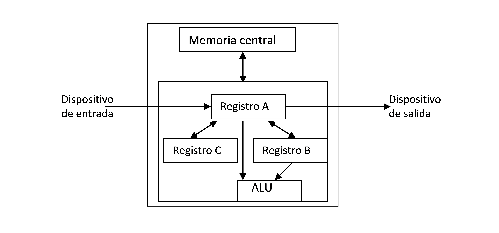
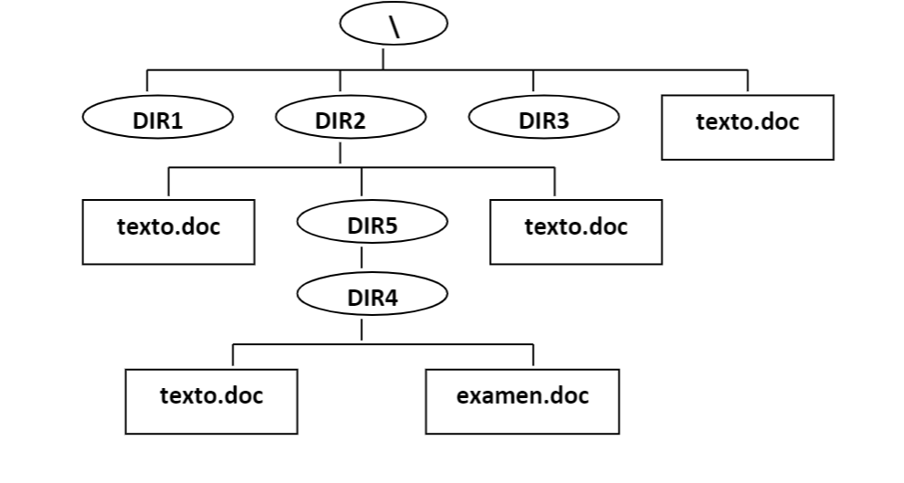

# Sesión 2.2 Auto-evaluación Tema 1

## Objetivos 

-	Representación de la información (sistemas de numeración, representación de información textual y numérica).
-	Hardware de computadoras (buses, MC, CPU, dispositivos de E/S).
-	Software de computadoras (sistema operativo, lenguajes de programación, traductores).
-	Manejo de un sistema operativo (interfaz gráfica de usuario, gestión de archivos).

## Competencias a desarrollar     

- [X]     RD1: Poseer y comprender conocimientos
- [X]     RD2: Aplicación de conocimientos
- [X]     UAL1: Conocimientos básicos de la profesión
- [X]     UAL3: Capacidad para resolver problemas
- [ ]     UAL6: Trabajo en equipo
- [X]     FB3: Conocimientos básicos sobre el uso y programación de los ordenadores, sistemas operativos, bases de datos y programas informáticos con aplicación en la ingeniería.

## Materiales 

No debería utilizar ningún material ni ayuda externa en la realización de esta actividad.

## Tarea     

 Realizar los ejercicios propuestos.

## Criterios de éxito 
-	Terminar en el tiempo previsto la tarea.
-	Obtener una calificación superior a 6.0.


## Plan de trabajo

Realizar los 10 ejercicios que constituyen la prueba de auto-evaluación del tema 1.	110 mn

Consultar las soluciones y evaluar los progresos. 	10 mn

## Ejercicios

### **1**. 

Transformar a binario los siguientes números, aproximando la parte fraccionaria a 3 cifras tras la coma:

- (30,2)<sub>10 </sub> 
  
       Respuesta:(11110,010)<sub>2</sub>

- (30,2)<sub>3 </sub> 
  
        Respuesta:No válido

- (30,2)<sub>5 </sub> 
  
         Respuesta:(1111,011)<sub>2</sub>

- (30,2)<sub>8 </sub> 
  
       Respuesta:(11000,010)<sub>2</sub>

### **2**. 
Efectuar las siguientes operaciones aritméticas directamente en el sistema de numeración indicado:

-	Base 2:        Nota: obtener solo 2  cifras fraccionarias 
    - 1100,1/0,11

            Respuesta:100110,10
    - 11101,01 * 1101		
 
             Respuesta:101,01
 -  Base 16:
    -  	A8900AC3D – FCD710	
 
              Respuesta:A8803D52D
    -  	F9AC * C8B
 
              Respuesta:C3BA064


### **3**.
En el sistema telegráfico inventado por Morse, cada carácter es codificado a base de puntos (señales cortas) y rayas (señales largas); Ejemplo: . (E) - (T) .- (A). El número de puntos y rayas usado depende del carácter a representar; por ello, las transmisiones telegráficas se realizan en serie y de forma asíncrona, dejando un pequeño tiempo de espera entre cada carácter transmitido. El alfabeto Morse consta de los siguientes caracteres (símbolos):

        Alfabéticos:	A B C D E F G H I J K L M N O P Q R S T U V W X Y Z
        Numéricos:	1 2 3 4 5 6 7 8 9 0
        Puntuación:	.  ,  ?  "  :  ;  (  =  _
        Otros:		Error    Espera   Fin_de_mensaje   Fin_de_transmisión


¿Cuál es el tamaño máximo (nº máximo de puntos y rayas) que puede tener un carácter en código Morse? Justificar la respuesta.


              Respuesta:
              

Nº máximo de caracteres que se pueden codificar: 2+4+8+16+32=62 

Nº de caracteres a representar=50


### **4**. 
Suponiendo que una computadora utiliza n=12 bits para representar números enteros, ¿cómo se representarían internamente los siguientes números decimales: +400, -500, +2048, -2048? Considerar las siguientes representaciones:

-	Signo y magnitud.

              Respuesta:+400=0001 1001 0000	
              -500=1001 1111 0100
              +2048=Fuera de rango en todas las representaciones
        -2048 =No se puede representar	

-	Complemento a 1.

              Respuesta:
              0001 1001 0000
              1110 0000 1011
              Fuera de rango en todas las representaciones
              No se puede representar	

-	Complemento a 2.

              Respuesta:
              0001 1001 0000
              1110 0000 1100
               Fuera de rango en todas las representaciones
1000 0000 0000
-	Sesgada (desplazada).

              Respuesta:
              1001 1001 0000
              0110 0000 1100
              Fuera de rango en todas las representaciones
              0000 0000 0000


### **5**.  
Considerar la representación de reales basada en el estándar IEEE 754, simple precisión.

-	Indicar a qué números decimales se corresponden los siguientes números (expresados en representación interna): 7F800001, 80400000

              Respuesta:
              7F800001 -> NaN

80400000 -> -0,5*2-126

-	Representar el siguiente número decimal: 	-1,0485768 * 106

              Respuesta:
              -1,0485768*106 -> C9800006

-	¿Es posible representar -∞ en dicho estándar? En caso afirmativo indicar como se representaría.

              Respuesta:-∞ -> FF800000

-	Calcular la precisión de esta representación, esto es, la diferencia entre un nº real cualquiera (diferente de cero y en representación normalizada) y el número real inmediatamente superior que es posible representar.

              Respuesta:Precisión: 2-23*2E=0,1*10-6*2E -> aproximadamente las 6 primeras cifras del número son exactas

### **6**. 
Considerar la siguiente arquitectura de una computadora sencilla:





Suponer que el lenguaje de bajo nivel (ensamblador) para esta máquina consta de las siguientes instrucciones:
|Instrucción|	Significado|
|----|----|
|CP A, B|	Copia el contenido del registro A en el B.
|CP B, A|	Copia el contenido del registro B en el A.
|CP A, C|	Copia el contenido del registro A en el C.
|CP C, A|	Copia el contenido del registro C en el A.
|ADD|	Suma los contenidos de A y B, dejando el resultado en A.
|MULT|	Multiplica los contenidos de A y B, dejando el resultado en A.
|INP|	Lee del teclado un valor y lo almacena en A.
|OUT|	Muestra en pantalla el valor almacenado en A.

Escribir las instrucciones en este lenguaje que permitan mostrar en pantalla el resultado de la siguiente operación: (x<sup>2</sup>+y<sup>2</sup>+2*x*y+x+y) donde los datos asociados a las variables x e y son introducidos por teclado uno a continuación de otro.


            Respuesta:
            Instrucción	Contenidos de los registros
````
	A	B
INP	x	
CP A,B	x	x
INP	y	x
ADD	y+x	x
CP A,B	y+x	y+x
MULT	(y+x)2	y+x
ADD	(y+x)2+(y+x)	y+x
OUT


### **7**. 
¿Dónde almacena la CPU la instrucción que se está ejecutando actualmente? ¿Dónde almacena los datos u operandos (si los hubiera) asociados a dicha instrucción? Cuando finaliza la instrucción actual, ¿dónde se encuentra la siguiente instrucción a ejecutar? ¿Cómo conoce la CPU la ubicación de dicha instrucción? 

            Respuesta:
            En la Unidad de Control -> registro IR (Registro de Instrucción)
- En la Unidad Aritmético-Lógica -> banco de registros
- En Memoria Central
- La dirección de memoria central donde está se almacena en el registro PC (Contador de Programa)


### **8**. 
Una computadora con un procesador de 32 bits (tamaño de palabra) y una frecuencia de reloj de 1 GHz, dispone de un bus de direcciones de 32 hilos. ¿Cuál es el tamaño máximo (en palabras) que puede tener la memoria central de dicha computadora? ¿Cuántos caracteres (bytes) caben en dicha memoria? Calcular el ancho de banda de la memoria para que dicha computadora transfiera una palabra en un ciclo de reloj. ¿Cuántos bytes se pueden transferir a memoria en 5 segundos?

            Respuesta:
             MC máxima -> 4 Gpalabras=16 GB
- Ancho de banda -> 3,7 GB/sg
- 5 sg -> 18,6 GB


### **9**.
Un programa escrito en un lenguaje de programación de alto nivel, ¿es posible ejecutarlo en cualquier computadora? En caso afirmativo, indicar cómo; en caso negativo, justificar la respuesta.
Un programa escrito en lenguaje máquina (binario), ¿es posible ejecutarlo en cualquier computadora? En caso afirmativo, indicar cómo; en caso negativo, justificar la respuesta.

            Respuesta:
            a)Si, pero traduciéndolo previamente al lenguaje máquina con su correspondiente traductor

b)No, solamente se puede ejecutar en computadoras con arquitectura compatible


### **10**. 

Considerar la siguiente estructura del sistema de archivos de un soporte de memoria secundario dado:




- Indicar la ruta (“path”) relativa del archivo examen.doc, cuando el directorio actual (o de trabajo) es respectivamente:
- \DIR2\DIR5
- \DIR3
- \
- ¿Es posible tener en un mismo dispositivo de memoria secundaria dos o más archivos con el mismo nombre? Justificar la respuesta.


            Respuesta:
            a)
            DIR4\examen.doc

\DIR2\DIR5\DIR4\examen.doc

DIR2\DIR5\DIR4\examen.doc

b)
Sí, siempre que estén en directorios diferentes
 


## Resultados de los ejercicios

1)


(30,2)<sub>10</sub> =(11110,010)<sub>2</sub>

(30,2)<sub>3</sub> No válido

(30,2)<sub>5</sub>=(1111,011)<sub>2</sub>

(30,2)<sub>8</sub>=(11000,010)<sub>2</sub>


2)

Base 2:	11101,01/0,11=100110,10

√11101,01=101,01

Base 16:	A8900AC3D-FCD710=A8803D52D

F9AC*C8B=C3BA064


3)


|---|	Signo y magnitud|	Complemento a 1	|Complemento a 2|	Desplazada|
|---|---|---|---|---|
|+400	|0001 1001 0000	|0001 1001 0000|	0001 1001 0000|	1001 1001 0000|
|-500	|1001 1111 0100	|1110 0000 1011	|1110 0000 1100|	0110 0000 1100|
|+2048	|Fuera de rango| en todas las |representaciones|
|-2048	|No se puede |representar|	1000 0000 0000|	0000 0000 0000|

5)

7F800001 -> NaN

80400000 -> -0,5*2-126

-1,0485768*106 -> C9800006

-∞ -> FF800000

Precisión: 2-23*2E=0,1*10-6*2E -> aproximadamente las 6 primeras cifras del número son exactas

6)

(x<sup>2</sup>+y<sup>2</sup>+2*x*y+x+y)

Instrucción	Contenidos de los registros
````
	A	B
INP	x	
CP A,B	x	x
INP	y	x
ADD	y+x	x
CP A,B	y+x	y+x
MULT	(y+x)2	y+x
ADD	(y+x)2+(y+x)	y+x
OUT

````

7)	

- En la Unidad de Control -> registro IR (Registro de Instrucción)
- En la Unidad Aritmético-Lógica -> banco de registros
- En Memoria Central
- La dirección de memoria central donde está se almacena en el registro PC (Contador de Programa)

8)

- MC máxima -> 4 Gpalabras=16 GB
- Ancho de banda -> 3,7 GB/sg
- 5 sg -> 18,6 GB

9)

Si, pero traduciéndolo previamente al lenguaje máquina con el correspondiente traductor

No, solamente se puede ejecutar en computadoras con arquitectura compatible (diferentes arquitecturas usan lenguajes máquina distintos y no compatibles entre sí)

10)

DIR4\examen.doc

\DIR2\DIR5\DIR4\examen.doc

DIR2\DIR5\DIR4\examen.doc

Sí, siempre que estén en directorios diferentes
 
